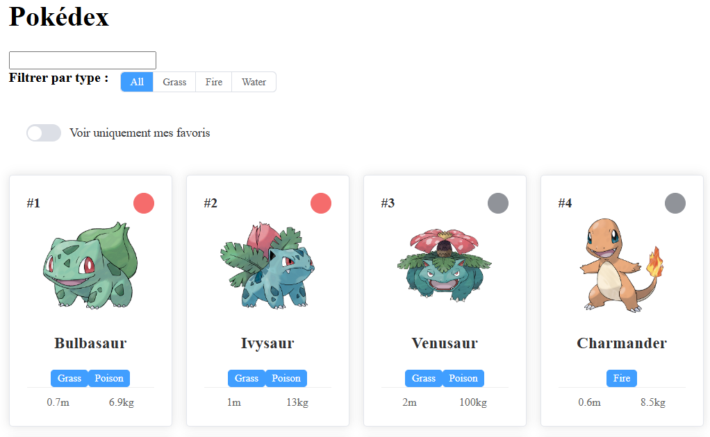
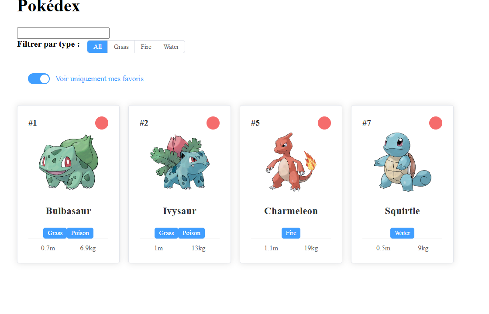

# Projet Pokédex - Nuxt 3 & PokéAPI

Ce projet est une application Pokédex moderne construite avec **Nuxt 4** et **Element Plus**. Il permet d'explorer les 151 premiers Pokémon de la première génération, de les filtrer et de gérer une liste de favoris.



## Fonctionnalités

- **Appel à l'API** : Récupération des données en temps réel depuis la [PokéAPI](https://pokeapi.co/).
- **Recherche Dynamique** : Filtrage par nom via la barre de recherche.
- **Filtrage par Type** : Sélection par type (Plante, Feu, Eau, etc.) avec mise à jour instantanée.
- **Système de Favoris** : 
  - Marquage des Pokémon favoris via une icône de cœur.
  - **Persistance** : Sauvegarde automatique dans le `localStorage` du navigateur.
- **Mode Favoris** : Filtre spécial pour afficher uniquement les Pokémon sauvegardés.
- **UI/UX** : Interface responsive et moderne utilisant les composants **Element Plus**.



## Technologies utilisées

- **Framework** : [Nuxt 4](https://nuxt.com/)
- **UI Library** : [Element Plus](https://element-plus.org/)
- **Data Source** : [PokéAPI](https://pokeapi.co/)
- **State** : Vue.js Composition API (ref, computed)

## Installation et Démarrage

1. **Installer les dépendances** :
   ```bash
   npm install
2. **Lancer le serveur de développement** :   
   npm run dev

L'application sera disponible sur http://localhost:3000  

## Structure du Projet

- **app/pages/index.vue** : Page principale contenant la logique de filtrage et l'appel API (useAsyncData).
- **app/components/PokemonCard.vue** : Composant réutilisable pour afficher les détails d'un Pokémon et gérer l'événement de mise en favori.